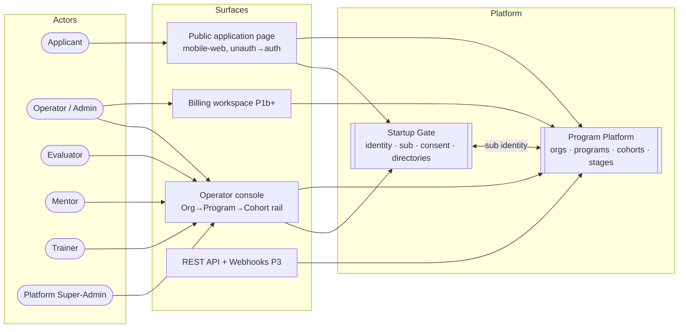
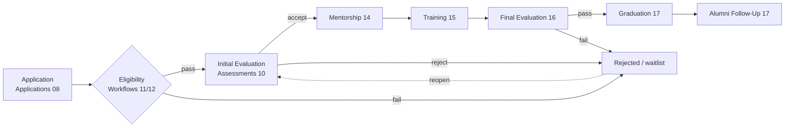
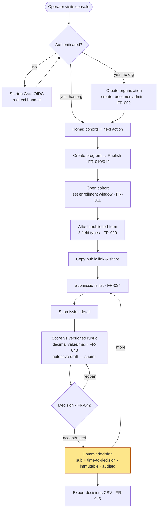
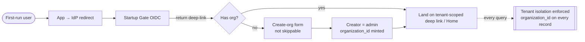
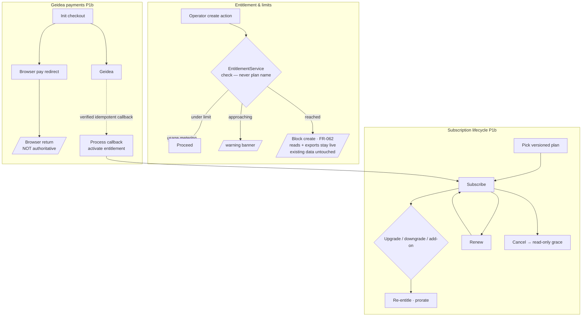
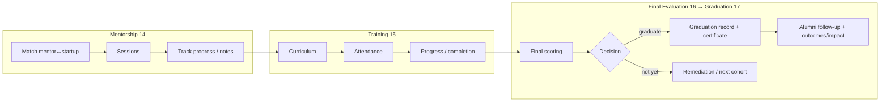
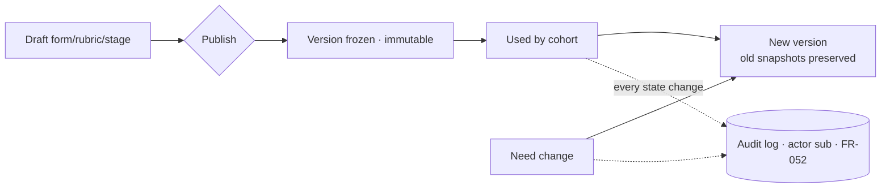

# Full Flow Diagram — All Product Flows

> Owner: Product · Last-updated: 2026-06-20
> Sources: `docs/product/lifecycle.md`, `_bmad-output/.../prd.md` (§5 journeys, §6 FRs, §7 phases),
> `_bmad-output/.../ux-designs/.../EXPERIENCE.md` (Key Flows + State Patterns),
> `docs/saas/commercial-architecture.md`, `docs/product/features/*`.
>
> Diagrams are [Mermaid](https://mermaid.js.org/) — they render natively on GitHub.
> Phase tags `[P1a] [P1b] [P2] [P3] [P4]` follow PRD §7. P1a = Selection MVP (live);
> later phases are capability-level and shown for the full picture.

---

## 0. System map — actors → surfaces → modules



---

## 1. Core participant lifecycle (configurable, per program)

Every program runs this stage chain; all stages are configurable templates driven by
the Stage engine + expression-rule kernel (`docs/product/lifecycle.md`).



> Stage transitions, entry/exit gates, and personalized-track applicability
> (`features/personalized-tracks.md`) are evaluated by the Stage engine.
> Published stages/forms/rubrics are **immutable + versioned**.

---

## 2. UJ-1 — Operator runs an intake `[P1a]` (happy path + states)



**Instrumentation emitted** (PRD FR-080): `rubric.edited`, `submission.scored{elapsed}`,
`decision.recorded{time_to_decision}`, `decisions.exported`.

---

## 3. UJ-2 — Applicant applies `[P1a]` (mobile-web, Arabic/RTL; branches + states)

```mermaid
flowchart TD
  LAND([Public cohort landing<br/>unauth · application.viewed]) --> OPEN{Cohort open?}
  OPEN -->|closed| CLOSED[/"This cohort closed on {date}."<br/>422 · show other open cohorts/]
  OPEN -->|open| APPLY[Tap Apply]
  APPLY --> AUTH[Authenticate via sub]
  AUTH -->|fail| AERR[/"Couldn't sign you in — try again"/]
  AUTH -->|ok| DUP{Already applied?}
  DUP -->|yes| STATUS[Status screen<br/>"You've already applied" · FR-032]
  DUP -->|no| FORM[Stepped form<br/>Next/Back · progress · per-section autosave]

  FORM -->|abandon| AB[(application.abandoned step → C3)]
  FORM --> REVIEW[Final step]
  REVIEW --> CONFIRM{Confirm:<br/>"You can't edit after submitting"}
  CONFIRM -->|cancel| FORM
  CONFIRM -->|submit once| SNAP[Capture immutable snapshot<br/>idempotent · FR-031/032]
  SNAP --> STATUS

  classDef peak fill:#fde68a,stroke:#b45309;
  class SNAP peak;
```

**Cross-tenant / missing** → neutral 404 "Not found or you don't have access" (`FR-004`,
never reveal another tenant). **Every interpolated value** wrapped `bdi` for RTL correctness.

---

## 4. Identity, tenancy & onboarding `[P1a]`



Subdomains / custom domains + branding are **`[P3]`** (`build-specs 66/67`): host →
tenant resolution rejects unknown hosts; custom domains need ownership verification + TLS.

---

## 5. SaaS commercial plane — subscription, billing, entitlements

Entitlement is **allow-all in P1a** (socket only); counters land P1b; Geidea billing P1b+.



> Plans versioned/immutable after publish · usage enforced server-side · no raw card/CVV ·
> callbacks verified + idempotent · browser return never authoritative
> (`CLAUDE.md` SaaS rules; `build-specs 59/60/61/62`).

---

## 6. Delivery flows (post-selection) `[P2]`+



Adjacent capability flows (each `docs/product/features/*`, mostly `[P2]`–`[P4]`):
hackathons/challenges, surveys, service marketplace & requests, risk-intervention,
formal documents, bulk operations/data-quality, outcomes & impact, interviews/public programs.

---

## 7. Cross-cutting flow: published-artifact immutability & audit `[P1a]`



---

### Coverage note (what's diagrammed vs deferred)

Diagrammed: system map, full lifecycle, both P1a journeys (UJ-1/UJ-2) with branches+states,
identity/tenancy, full SaaS plane (entitlement/subscription/payments), delivery (mentorship/
training/final/graduation/alumni), immutability/audit. Per-feature internal flows
(`docs/product/features/*`, P2–P4) are listed in §6, not expanded — add when each is specced.
